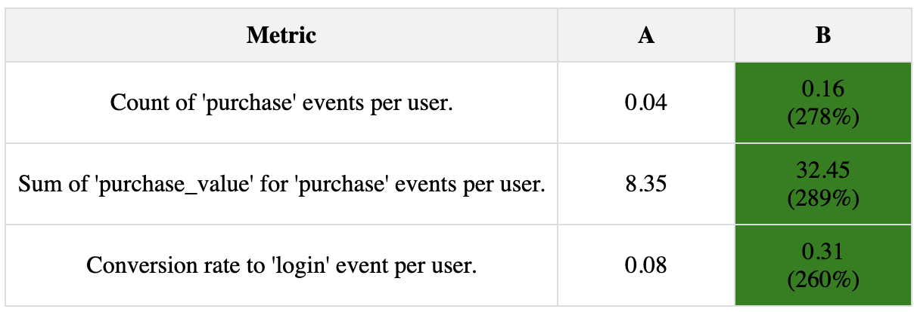

# AB Test Advanced Toolkit

[](https://pypi.org/project/variatio/)
[](https://github.com/dmitry-brazhenko/SharpToken/actions/workflows/build-test-and-publish.yml)
[](https://github.com/dmitry-brazhenko/Variatio/issues)
[](LICENSE)

AB Test Advanced Toolkit is an experimental Python library designed for advanced A/B testing analysis. It leverages statistical techniques and machine learning, including variance reduction through CUPED and integration with XGBoost for predictive insights. AB Test Advanced Toolkit is ideal for data scientists and researchers looking to obtain deeper insights from their A/B testing efforts.

## Features

This tool streamlines A/B testing by automatically calculating all the classic metrics behind the scenes. Simply provide your data, and it will compute the metrics you request, delivering them in a visually appealing report. Here are some of the key features:

- **Statistical Significance Testing:** Easily compare metrics between control and test groups, with all necessary calculations done for you.
- **CUPED Adjustments:** This experimental extension utilizes Controlled-experiment Using Pre-Experiment Data (CUPED) techniques for variance reduction. It innovatively employs user properties as covariates and leverages XGBoost regression, moving beyond traditional linear approaches to enhance A/B test sensitivity.

## Installation

```bash
pip install ab_test_advanced_toolkit
```

or install AB Test Advanced Toolkit directly from the source:

```bash
git clone https://github.com/dmitry-brazhenko/ab-test-advanced-toolkit.git
cd ab_test_advanced_toolkit
pip install .
```

## Data Preparation

To use AB Test Advanced Toolkit effectively, you need to prepare three main types of data:

### 1. Event Data

The `event_data` is crucial for analysis in AB Test Advanced Toolkit. It tracks user interactions and should include the following mandatory columns:

- `timestamp`: The date and time when the event occurred.
- `userid`: A unique identifier for the user who triggered the event.
- `event_name`: The name of the event (e.g., 'login', 'purchase').

In addition to these mandatory columns, you can include optional attributes that provide additional details about each event. For example, `purchase_value` could be used to track the value of purchase events. These optional attributes can vary based on the event type and what you aim to analyze.

**Event Data Example:**

| timestamp           | userid | event_name | purchase_value |
|---------------------|--------|------------|----------------|
| 2023-01-01 00:00:00 | 7      | purchase   | 274            |
| 2023-01-01 01:00:00 | 4      | purchase   | 175            |
| 2023-01-01 02:00:00 | 5      | purchase   | 179            |
| 2023-01-01 03:00:00 | 7      | purchase   | 102            |
| 2023-01-01 04:00:00 | 3      | login      | 0              |

### 2. User Allocations Data Sample

The `ab_test_allocations` dataset is essential for understanding the distribution of users across different A/B test groups. It includes the following columns:

- `timestamp`: The date and time when the user was attributed to a specific A/B test group. This helps track when each user started experiencing the variant they were allocated to.
- `userid`: A unique identifier for the user.
- `abgroup`: The A/B test group the user was allocated to. This typically represents the control group (e.g., 'A') and one or more test groups (e.g., 'B', 'C').

**Example:**

| timestamp           | userid | abgroup |
|---------------------|--------|---------|
| 2022-12-15 00:00:00 | 1      | A       |
| 2022-12-15 01:00:00 | 2      | B       |
| 2022-12-15 02:00:00 | 3      | B       |
| 2022-12-15 03:00:00 | 4      | B       |
| 2022-12-15 04:00:00 | 5      | A       |

### 3. User Properties Data Sample (Optional)

This optional `user_properties` dataset can enhance the analysis with user demographic or behavioral data. The `userid` column must match the `event_data` and `ab_test_allocations` datasets.

| userid | age | gender | country    | device_type | membership_status |
|--------|-----|--------|------------|-------------|-------------------|
| 1      | 56  | Male   | USA        | Tablet      | Free              |
| 2      | 69  | Female | India      | Mobile      | Free              |
| 3      | 46  | Male   | Australia  | Tablet      | Free              |
| 4      | 32  | Female | UK         | Tablet      | Free              |
| 5      | 60  | Male   | Germany    | Tablet      | Free              |

## Using ABTestAnalyzer

After preparing your datasets, you can use `ABTestAnalyzer` to perform A/B testing analysis. Initialize the analyzer with your datasets and specify the control group:

```python
from ab_test_advanced_toolkit.analyzer import ABTestAnalyzer
import pandas as pd

event_data = pd.DataFrame({
    "timestamp": pd.to_datetime(["2023-01-01 00:00:00", "2023-01-01 01:00:00", 
                                 "2023-01-01 02:00:00",
                  "2023-01-01 03:00:00", "2023-01-01 04:00:00"]),
    "userid": [7, 4, 5, 7, 3],
    "event_name": ["purchase", "purchase", "purchase", "purchase", "login"],
    "purchase_value": [274, 175, 179, 102, 0]
})

# Creating the user_allocations DataFrame
user_allocations = pd.DataFrame({
    "timestamp": pd.to_datetime(["2022-12-15 00:00:00", "2022-12-15 01:00:00", 
                                 "2022-12-15 02:00:00",
                  "2022-12-15 03:00:00", "2022-12-15 04:00:00"]),
    "userid": [1, 2, 3, 4, 5],
    "abgroup": ["A", "B", "B", "B", "A"]
})

# Creating the user_properties DataFrame
user_properties = pd.DataFrame({
    "userid": [1, 2, 3, 4, 5],
    "age": [56, 69, 46, 32, 60],
    "gender": ["Male", "Female", "Male", "Female", "Male"],
    "country": ["USA", "India", "Australia", "UK", "Germany"],
    "device_type": ["Tablet", "Mobile", "Tablet", "Tablet", "Tablet"],
    "membership_status": ["Free", "Free", "Free", "Free", "Free"]
})

analyzer = ABTestAnalyzer(event_data, user_allocations, "A", user_properties, mode="gboost_cuped")
```

You can then calculate various metrics such as event count per user, attribute sum per user (useful for calculating metrics like ARPU), or conversion rates to specific events:

```python
# Calculate the count of 'purchase' events per user
analyzer.calculate_event_count_per_user('purchase')

# Calculate the sum of 'purchase_value' for 'purchase' events per user
analyzer.calculate_event_attribute_sum_per_user('purchase', 'purchase_value')

# Calculate the conversion rate to 'login' events
analyzer.calculate_conversion('login')
```

### Generating Reports

After calculating the desired metrics, you can save them to an HTML file for easy viewing:

```python
analyzer.save_report("abtest_report.html")
```

Here's a sample report showcasing meticulously calculated metrics, organized in an easy-to-analyze table format.



## Contribution Guidelines

We welcome contributions to AB Test Advanced Toolkit! If you'd like to contribute, please follow these guidelines:

- Fork the repository and create your feature branch.
- Make sure your code adheres to the project's coding standards.
- Submit a pull request with a detailed description of your changes.

## License

AB Test Advanced Toolkit is licensed under the MIT License. See [LICENSE](LICENSE) for more details.

## Disclaimer

AB Test Advanced Toolkit is shared with the community as an experimental library, offered "as-is" and without any warranties. Your explorations and tests with it are encouraged, but please proceed with awareness of its experimental nature. We're keen to hear about your experiences and eager to tackle any challenges you encounter. Should you have questions or face any issues, don't hesitate to open an issue in our repository. We welcome your feedback and contributions to make AB Test Advanced Toolkit even better!

## Tests

```bash
pytest
```
